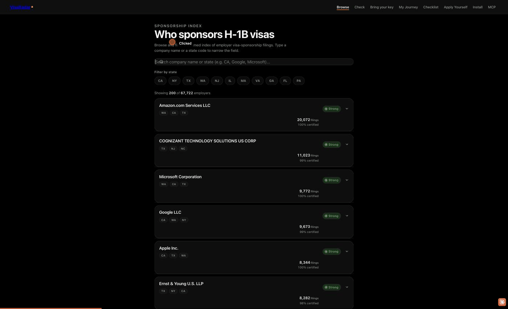

# VisaRadar

[](https://github.com/Ps23102004/VisaRadar/actions/workflows/tests.yml)

Paste a job posting, get a real answer on whether that employer actually sponsors work visas — backed by a local LLM extraction pass and **real U.S. Department of Labor LCA filing data** (H-1B / H-1B1 / E-3), not a curated job board's marketing copy.

Every other "visa sponsor" resource is a database you browse. VisaRadar is a tool you point at *any* posting.



```
$ radar check "Senior SWE at Google LLC. We sponsor H-1B for qualified candidates." --json
{
  "company": "Google LLC",
  "title": "Senior SWE",
  "label": "strong",
  "evidence": [
    "total filings: 9673",
    "certified percentage: 99%",
    "increasing filing volume from 2025 (897) to 2026 (7383)",
    "top job titles: Software Engineer, Technical Program Manager, Product Manager"
  ],
  "match_confidence": 1.0
}
```

## Install

```bash
pip install -e .
```

## Prerequisites

An LLM backend. VisaRadar isn't tied to one provider:

- **Local (default, free)**: [Ollama](https://ollama.com/) running at `127.0.0.1:11434` with a model pulled (`ollama pull qwen3.8:27b-mlx` or any model you prefer).
- **Any OpenAI-compatible API**: OpenRouter, Groq, Together, LM Studio, vLLM, or OpenAI itself. Set `--model provider/model` and export that provider's API key env var (see `radar config` for the exact var name per provider).

The bundled snapshot (`visaradar/lca_snapshot.jsonl.gz`) covers FY2024–FY2026, built from DOL's own public disclosure files. No network access needed to look up a company — only the LLM call needs connectivity (and none at all if you're running fully local).

## Usage

```bash
# Full pipeline: LLM extraction + real filing data
radar check "<paste a job posting>"
radar check --file posting.txt
radar check --url https://company.com/careers/some-role

# Direct lookup, no LLM call at all
radar company "Google"
radar company "Gooogle Inc"          # fuzzy match, shows candidates + scores

# Point it at any provider
radar check "..." --model openrouter/google/gemini-3.7-flash
export OPENROUTER_API_KEY=...

# See what's resolved
radar config
radar history --limit 10
```

### Local-first storage, Obsidian-friendly

Every check is logged to `~/.visaradar/history.jsonl`, and — unless you pass `--no-notes` — also written as a Markdown note with frontmatter to `~/.visaradar/notes/`. Point `--data-dir` (or `VISARADAR_DATA_DIR`) at a folder inside your own Obsidian vault and every lookup just shows up there as a normal note. VisaRadar never deletes or prunes; retention is entirely yours.

### Web

A self-contained, zero-dependency site in `web/` — no build tooling, just open the HTML files. One exception: `app.html` reads `web/employers.json`, which is generated (not committed — it's derived data, kept out of git so it can't go stale silently) and served over `http://`, not `file://` (the browser blocks a same-origin `fetch()` under the `file://` origin):

```bash
python scripts/export_browser_data.py   # writes web/employers.json
python -m http.server --directory web 8000
# open http://localhost:8000/app.html
```

- **`app.html`** — the unified Browser experience. Its Browse, Check, Checklist, and My Journey tabs share company, state, country, and visa-type state: search the bundled 67,722-employer dataset, select a company to visualize its filing history, consult the official-document checklist, and track progress locally in the browser.
- **`byok.html`** — no CLI install needed: pick a provider (or local Ollama, no key), paste your API key, paste a posting, and it calls the LLM directly from the browser. Your key never leaves local storage except to the provider you chose.
- **`guide.html`** — a step-by-step "apply yourself" guide against the expensive-agent problem, with real government fee totals and a per-country reciprocity-fee lookup (5 confirmed countries, links to the official State Department index for the rest).
- **`install.html`** / **`mcp.html`** — CLI reference and MCP setup instructions.

Every result — CLI, MCP, and the web experience — now also surfaces the real median wage filed for that employer (from DOL LCA `WAGE_RATE_OF_PAY`/`WAGE_UNIT_OF_PAY` data) alongside a cost-of-living-adjusted figure for the employer's top filing state, using BEA Regional Price Parity data.

### MCP

```bash
pip install -e ".[mcp]"
```

Exposes `visaradar_company` (direct lookup, no LLM) and `visaradar_check` (full extraction pipeline) as MCP tools — attach VisaRadar to Claude Desktop, Claude Code, or any MCP client. See `web/mcp.html` for config.

## Where it fails

Measured against the bundled FY2024–FY2026 snapshot (67,722 employers, 659,117 filings):

- **Brand names miss legal names, and big employers split across many.** LCAs are filed under legal entities, and matching is exact-after-normalisation, then `difflib` at 0.85. Before the fix "Meta" found nothing (labelled `none`, really 7,503 filings) and "Amazon" matched a 2-filing shell (labelled `weak`, really 28,891 across 18 entities). `matcher.py` now has a hand-curated brand table (Amazon, Deloitte, Meta/Facebook, OpenAI, Anthropic, JPMorgan) that sums sibling entities and says so in the evidence. It is **only** those names: any other brand that files under a different legal name still misses, and a generic prefix rollup was rejected because it merges APPLE TREE DENTAL into Apple and META SOFT into Meta. Add a row when a lookup misleads.
- **"Certified" says almost nothing.** 97.9% of all LCAs in the snapshot are certified. A certified LCA is a wage attestation, not an approved H-1B petition, and it doesn't mean the employer won the lottery or will file for you.
- **The label is a filing count.** `strong` means 20 or more filings across three years, for any role. It doesn't know whether the employer sponsors *this* role or level, and it covers H-1B / H-1B1 / E-3 only, not green cards (PERM).
- **The newest fiscal year is partial**, so a "decreasing" trend may just be an incomplete year. The evidence line says so, but the label ignores it.

## Why this exists

Every "find visa-sponsor jobs" resource on the internet is a curated database — someone else's judgment call about which companies to include, updated on someone else's schedule. VisaRadar inverts that: point it at *any* posting from *any* company, and it cross-references real DOL LCA filing history (public domain, quarterly, authoritative — not scraped from a SaaS product's ToS-violating aggregation) to give you an evidence-backed answer, not a vibe. It's the tool a developer navigating this themselves would actually want, not a lead-gen database.
